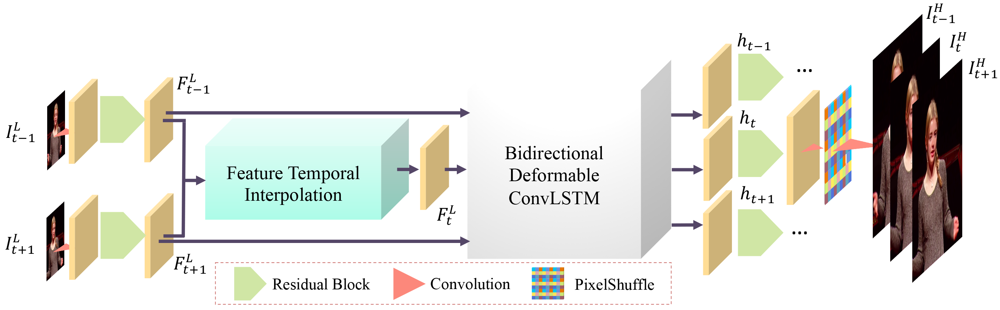

# Zooming-Slow-Mo (CVPR-2020)

By [Xiaoyu Xiang<sup>\*</sup>](https://engineering.purdue.edu/people/xiaoyu.xiang.1), [Yapeng Tian<sup>\*</sup>](http://yapengtian.org/), [Yulun Zhang](http://yulunzhang.com/), [Yun Fu](http://www1.ece.neu.edu/~yunfu/), [Jan P. Allebach<sup>+</sup>](https://engineering.purdue.edu/~allebach/), [Chenliang Xu<sup>+</sup>](https://www.cs.rochester.edu/~cxu22/) (<sup>\*</sup> equal contributions, <sup>+</sup> equal advising)

This is the official Pytorch implementation of _Zooming Slow-Mo: Fast and Accurate One-Stage Space-Time Video Super-Resolution_.

#### [Paper](https://arxiv.org/abs/2002.11616) | [Journal Version](https://arxiv.org/abs/2104.07473) | [Demo (YouTube)](https://youtu.be/8mgD8JxBOus) | [1-min teaser (YouTube)](https://www.youtube.com/watch?v=C1o85AXUNl8) | [1-min teaser (Bilibili)](https://www.bilibili.com/video/BV1GK4y1t7nb/)

<table>
  <thead>
    <tr>
      <td>Input&nbsp;&nbsp;&nbsp;&nbsp;</td>
      <td>Output</td>
    </tr>
  </thead>
  <tr>
    <td colspan="2">
      <a href="https://youtu.be/8mgD8JxBOus">
        
        </img>
      </a>
    </td>
  </tr>
</table>

## Updates

- 2020.3.13 Add meta-info of datasets used in this paper
- 2020.3.11 Add new function: video converter
- 2020.3.10: Upload the complete code and pretrained models

## Contents

0. [Introduction](#introduction)
1. [Prerequisites](#Prerequisites)
2. [Get Started](#Get-Started)
   - [Installation](#Installation)
   - [Training](#Training)
   - [Testing](#Testing)
   - [Colab Notebook](#Colab-Notebook)
3. [Citations](#citations)
4. [Contact](#Contact)
5. [License](#License)
6. [Acknowledgments](#Acknowledgments)

## Introduction

The repository contains the entire project (including all the preprocessing) for one-stage space-time video super-resolution with Zooming Slow-Mo.

Zooming Slow-Mo is a recently proposed joint video frame interpolation (VFI) and video super-resolution (VSR) method, which directly synthesizes an HR slow-motion video from an LFR, LR video. It is going to be published in [CVPR 2020](http://cvpr2020.thecvf.com/). The most up-to-date paper with supplementary materials can be found at [arXiv](https://arxiv.org/abs/2002.11616).

In Zooming Slow-Mo, we firstly temporally interpolate features of the missing LR frame by the proposed feature temporal interpolation network. Then, we propose a deformable ConvLSTM to align and aggregate temporal information simultaneously. Finally, a deep reconstruction network is adopted to predict HR slow-motion video frames. If our proposed architectures also help your research, please consider citing our paper.

Zooming Slow-Mo achieves state-of-the-art performance by PSNR and SSIM in Vid4, Vimeo test sets.



## Prerequisites

- Python 3 (Recommend to use [Anaconda](https://www.anaconda.com/download/#linux))
- [PyTorch >= 1.1](https://pytorch.org/)
- NVIDIA GPU + [CUDA](https://developer.nvidia.com/cuda-downloads)
- [Deformable Convolution v2](https://arxiv.org/abs/1811.11168), we adopt [CharlesShang's implementation](https://github.com/CharlesShang/DCNv2) in the submodule.
- Python packages: `pip install numpy opencv-python lmdb pyyaml pickle5 matplotlib seaborn`

## Get Started

### Installation

Install the required packages: `pip install -r requirements.txt`

First, make sure your machine has a GPU, which is required for the DCNv2 module.

1. Clone the Zooming Slow-Mo repository. We'll call the directory that you cloned Zooming Slow-Mo as ZOOMING_ROOT.

```Shell
git clone --recursive https://github.com/Mukosame/Zooming-Slow-Mo-CVPR-2020.git
```

2. Compile the DCNv2:

```Shell
cd $ZOOMING_ROOT/codes/models/modules/DCNv2
bash make.sh         # build
python test.py    # run examples and gradient check
```

Please make sure the test script finishes successfully without any errors before running the following experiments.

### Training

#### Part 1: Data Preparation

1. Download the original training + test set of `Vimeo-septuplet` (82 GB).

```Shell
wget http://data.csail.mit.edu/tofu/dataset/vimeo_septuplet.zip
apt-get install unzip
unzip vimeo_septuplet.zip
```

2. Split the `Vimeo-septuplet` into a training set and a test set, make sure you change the dataset's path to your download path in script, also you need to run for the training set and test set separately:

```Shell
cd $ZOOMING_ROOT/codes/data_scripts/sep_vimeo_list.py
```

This will create `train` and `test` folders in the directory of **`vimeo_septuplet/sequences`**. The folder structure is as follows:

```
vimeo_septuplet
├── sequences
    ├── 00001
        ├── 0266
            ├── im1.png
            ├── ...
            ├── im7.png
        ├── 0268...
    ├── 00002...
├── readme.txt
├──sep_trainlist.txt
├── sep_testlist.txt
```

3. Generate low resolution (LR) images. You can either do this via MATLAB or Python (remember to configure the input and output path):

```Matlab
# In Matlab Command Window
run $ZOOMING_ROOT/codes/data_scripts/generate_LR_Vimeo90K.m
```

```Shell
python $ZOOMING_ROOT/codes/data_scripts/generate_mod_LR_bic.py
```

4. Create the LMDB files for faster I/O speed. Note that you need to configure your input and output path in the following script:

```Shell
python $ZOOMING_ROOT/codes/data_scripts/create_lmdb_mp.py
```

The structure of generated lmdb folder is as follows:

```
Vimeo7_train.lmdb
├── data.mdb
├── lock.mdb
├── meta_info.txt
```

#### Part 2: Train

**Note:** In this part, we assume you are in the directory **`$ZOOMING_ROOT/codes/`**

1. Configure your training settings that can be found at [options/train](./codes/options/train). Our training settings in the paper can be found at [train_zsm.yml](https://github.com/Mukosame/Zooming-Slow-Mo-CVPR-2020/blob/master/codes/options/train/train_zsm.yml). We'll take this setting as an example to illustrate the following steps.

2. Train the Zooming Slow-Mo model.

```Shell
python train.py -opt options/train/train_zsm.yml
```

After training, your model `xxxx_G.pth` and its training states, and a corresponding log file `train_LunaTokis_scratch_b16p32f5b40n7l1_600k_Vimeo_xxxx.log` are placed in the directory of `$ZOOMING_ROOT/experiments/LunaTokis_scratch_b16p32f5b40n7l1_600k_Vimeo/`.

### Testing

We provide the test code for both standard test sets (Vid4, SPMC, etc.) and custom video frames.

#### Pretrained Models

Our pretrained model can be downloaded via [GitHub](https://github.com/Mukosame/Zooming-Slow-Mo-CVPR-2020/blob/master/experiments/pretrained_models/xiang2020zooming.pth) or [Google Drive](https://drive.google.com/open?id=1xeOoZclGeSI1urY6mVCcApfCqOPgxMBK).

#### From Video

If you have installed ffmpeg, you can convert any video to a high-resolution and high frame-rate video using [video_to_zsm.py](./codes/video_to_zsm.py). The corresponding commands are:

```Shell
cd $ZOOMING_ROOT/codes
python video_to_zsm.py --video PATH/TO/VIDEO.mp4 --model PATH/TO/PRETRAINED/MODEL.pth --output PATH/TO/OUTPUT.mp4
```

We also write the above commands to a Shell script, so you can directly run:

```Shell
bash zsm_my_video.sh
```

#### From Extracted Frames

As a quick start, we also provide some example images in the [test_example](./test_example) folder. You can test the model with the following commands:

```Shell
cd $ZOOMING_ROOT/codes
python test.py
```

- You can put your own test folders in the [test_example](./test_example) too, or just change the input path, the number of frames, etc. in [test.py](codes/test.py).

- Your custom test results will be saved to a folder here: `$ZOOMING_ROOT/results/your_data_name/`.

#### Evaluate on Standard Test Sets

The [test.py](codes/test.py) script also provides modes for evaluation on the following test sets: `Vid4`, `SPMC`, etc. We evaluate PSNR and SSIM on the Y-channels in YCrCb color space. The commands are the same with the ones above. All you need to do is the change the data_mode and corresponding path of the standard test set.

### Colab Notebook

PyTorch Colab notebook (provided by [@HanClinto](https://github.com/HanClinto)): [HighResSlowMo.ipynb](https://gist.github.com/HanClinto/49219942f76d5f20990b6d048dbacbaf)

## Citations

If you find the code helpful in your resarch or work, please cite the following papers.

```BibTex
@misc{xiang2021zooming,
  title={Zooming SlowMo: An Efficient One-Stage Framework for Space-Time Video Super-Resolution},
  author={Xiang, Xiaoyu and Tian, Yapeng and Zhang, Yulun and Fu, Yun and Allebach, Jan P and Xu, Chenliang},
  archivePrefix={arXiv},
  eprint={2104.07473},
  year={2021},
  primaryClass={cs.CV}
}

@InProceedings{xiang2020zooming,
  author = {Xiang, Xiaoyu and Tian, Yapeng and Zhang, Yulun and Fu, Yun and Allebach, Jan P. and Xu, Chenliang},
  title = {Zooming Slow-Mo: Fast and Accurate One-Stage Space-Time Video Super-Resolution},
  booktitle = {IEEE/CVF Conference on Computer Vision and Pattern Recognition (CVPR)},
  pages={3370--3379},
  month = {June},
  year = {2020}
}

@InProceedings{tian2018tdan,
  author={Yapeng Tian, Yulun Zhang, Yun Fu, and Chenliang Xu},
  title={TDAN: Temporally Deformable Alignment Network for Video Super-Resolution},
  booktitle = {IEEE/CVF Conference on Computer Vision and Pattern Recognition (CVPR)},
  pages={3360--3369},
  month = {June},
  year = {2020}
}

@InProceedings{wang2019edvr,
  author    = {Wang, Xintao and Chan, Kelvin C.K. and Yu, Ke and Dong, Chao and Loy, Chen Change},
  title     = {EDVR: Video restoration with enhanced deformable convolutional networks},
  booktitle = {The IEEE Conference on Computer Vision and Pattern Recognition Workshops (CVPRW)},
  month     = {June},
  year      = {2019},
}
```

## Contact

[Xiaoyu Xiang](https://engineering.purdue.edu/people/xiaoyu.xiang.1) and [Yapeng Tian](http://yapengtian.org/).

You can also leave your questions as issues in the repository. We will be glad to answer them.

## License

This project is released under the [GNU General Public License v3.0](https://github.com/Mukosame/Zooming-Slow-Mo-CVPR-2020/blob/master/LICENSE).

## Acknowledgments

Our code is inspired by [TDAN-VSR](https://github.com/YapengTian/TDAN-VSR) and [EDVR](https://github.com/xinntao/EDVR).
