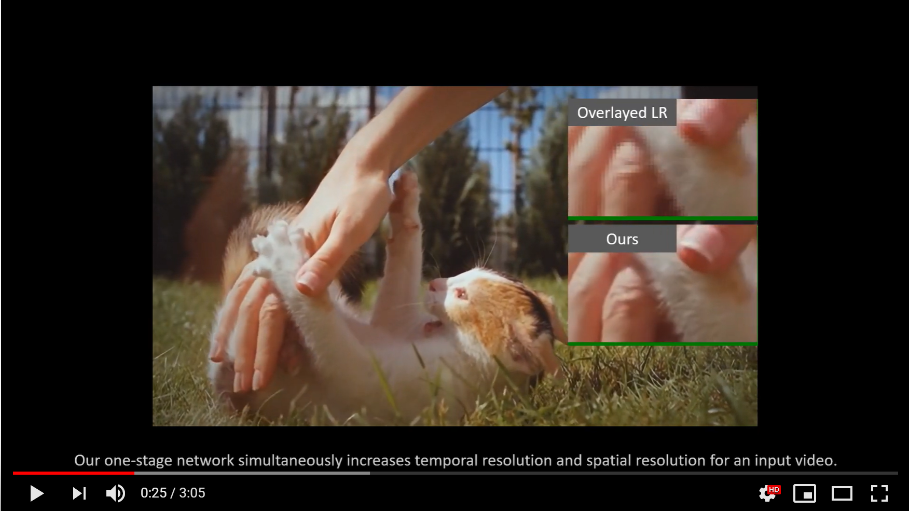

# Zooming-Slow-Mo (CVPR-2020)
This is the official Pytorch implementation of Zooming Slow-Mo: Fast and Accurate One-Stage Space-Time Video Super-Resolution.

*This repo is currently under construction. The complete version of code will be released by June. 14, 2020*

[](https://youtu.be/8mgD8JxBOus)

## Citations
If you find the code helpful in your resarch or work, please cite the following papers.
```
@InProceedings{Xiang2020ZoomingSlowMo,
  author = {Xiang, Xiaoyu and Tian, Yapeng and Zhang, Yulun and Fu, Yun and Jan, Allebach and Xu, Chenliang},
  title = {Zooming Slow-Mo: Fast and Accurate One-Stage Space-Time VideoSuper-Resolution},
  booktitle = {The IEEE Conference on Computer Vision and Pattern Recognition (CVPR)},
  month = {June},
  year = {2020}
}

@InProceedings{tian2018tdan,
  author={Yapeng Tian, Yulun Zhang, Yun Fu, and Chenliang Xu},
  title={TDAN: Temporally Deformable Alignment Network for Video Super-Resolution},
  booktitle = {The IEEE Conference on Computer Vision and Pattern Recognition (CVPR)},
  month = {June},
  year = {2020}
}

@InProceedings{wang2019edvr,
  author    = {Wang, Xintao and Chan, Kelvin C.K. and Yu, Ke and Dong, Chao and Loy, Chen Change},
  title     = {EDVR: Video restoration with enhanced deformable convolutional networks},
  booktitle = {The IEEE Conference on Computer Vision and Pattern Recognition Workshops (CVPRW)},
  month     = {June},
  year      = {2019},
}
```
